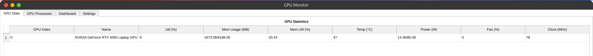
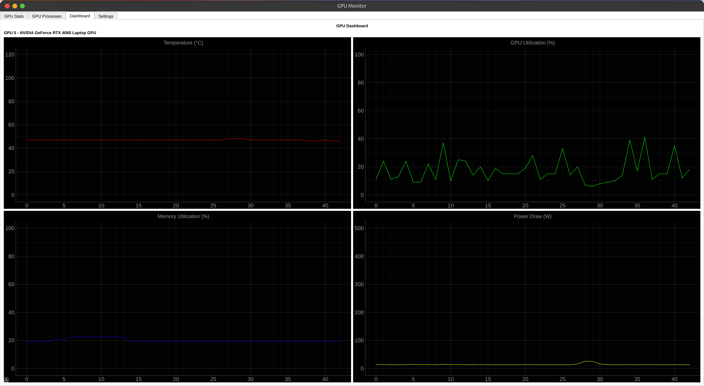
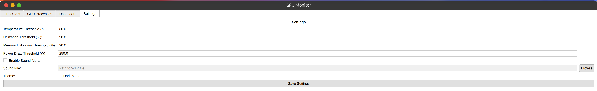

# GPU Monitor

GPU Monitor is a PyQt5-based application that allows users to monitor NVIDIA GPU performance metrics, such as utilization, memory usage, temperature, and power draw, in real-time. It also includes alert systems and visual dashboards for detailed analysis.

## Features

- **Real-time Monitoring**:
  - GPU utilization
  - Memory utilization and usage
  - Temperature
  - Power draw
  - Fan speed and clock rates

- **Alert System**:
  - Threshold-based alerts for temperature, utilization, memory usage, and power draw.
  - Desktop notifications and optional sound alerts.

- **Process Monitoring**:
  - List active processes using each GPU, including process type (Graphics/Compute), memory usage, and process names.
  - Kill GPU processes directly from the context menu.

- **Customizable Settings**:
  - User-configurable thresholds for alerts.
  - Toggle sound alerts and select custom sound files.
  - Light/Dark theme toggle.

- **Dashboard**:
  - Interactive graphs for real-time visualization of GPU statistics.

## Running the Compiled Binary
The application has been compiled using Nuitka, allowing users to run it without needing Python or additional dependencies installed.

### How to Run
1. Download the precompiled binary file (`gpu_monitor.bin`) from the provided release or distribution source.
2. Open a terminal and navigate to the folder containing the binary.
3. Run the binary using:
    ```bash
    ./gpu_monitor.bin
    ```
4. The application will launch, and you can start monitoring your GPU metrics.
5. For advanced configuration, refer to the command-line arguments section below.


## Development Environment

Every developer has their own preferences for tools and setup. Here is a list of tools and extensions that I use for development: If you intend to contribute to the project, you may find these tools useful.

## Prerequisites

Ensure you have the following installed:

1. Python 3.6+
2. PyQt5
3. PyQtGraph
4. pynvml
5. numpy
6. plyer (optional, for desktop notifications)

You can install the dependencies using:

```bash
pip install PyQt5 pyqtgraph pynvml numpy plyer dbus-python
```

For sound alerts, ensure the selected sound file is in WAV format.

## Installation

1. Clone the repository or download the source code:
   ```bash
   git clone https://github.com/Diyarbekoralbaev/gpu-monitor.git
   cd gpu-monitor
   ```

2. Run the application:
   ```bash
   python main.py
   ```

## Usage

1. Launch the application using the command:
   ```bash
   python main.py
   ```

2. Use the tabs for different functionalities:
   - **GPU Stats**: View real-time GPU metrics.
   - **GPU Processes**: Monitor and manage GPU processes.
   - **Dashboard**: View real-time graphs for GPU statistics.
   - **Settings**: Customize thresholds, enable/disable alerts, and switch themes.

3. Customize the thresholds in the "Settings" tab to define alert conditions.

## Command-line Arguments

The application supports the following command-line arguments for advanced configuration:

- `--temp`: Set temperature threshold in °C (default: 80.0).
- `--util`: Set GPU utilization threshold in % (default: 90.0).
- `--mem-util`: Set memory utilization threshold in % (default: 90.0).
- `--power`: Set power draw threshold in Watts (default: 250.0).
- `--sound`: Enable sound alerts when thresholds are exceeded.
- `--sound-file`: Path to custom WAV file for sound alerts.

Example:

```bash
python gpu_monitor_pyqt.py --temp 75 --util 85 --sound --sound-file alert.wav
```

## Screenshots

### GPU Stats Tab


### Dashboard


### Settings


## Acknowledgments

- [PyQt5](https://riverbankcomputing.com/software/pyqt/intro)
- [pyqtgraph](https://www.pyqtgraph.org/)
- [pynvml](https://pypi.org/project/pynvml/)
- [numpy](https://numpy.org/)
- [plyer](https://plyer.readthedocs.io/en/latest/)

## License

This project is licensed under the MIT License. See the `LICENSE` file for details.

## Contact

For any questions or issues, please contact me at [diyarbekdev@gmail.com](mailto:diyarbekdev@gmail.com).
Other contact information can be found on my [GitHub profile](https://github.com/Diyarbekoralbaev/).

---